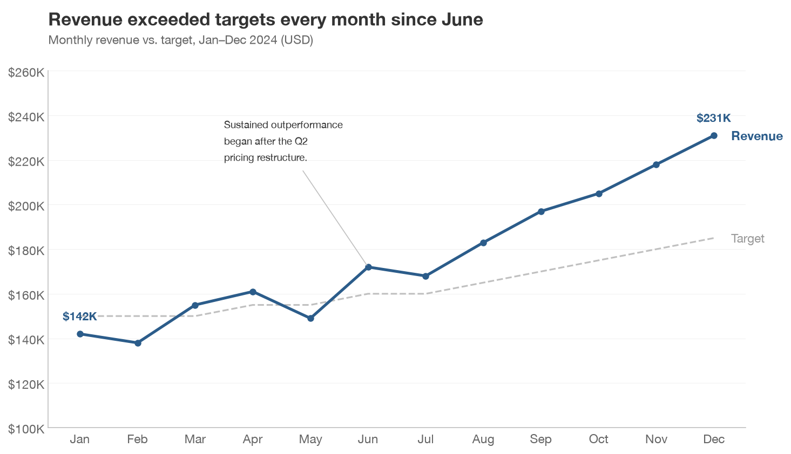
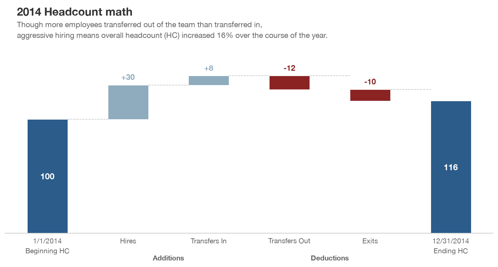
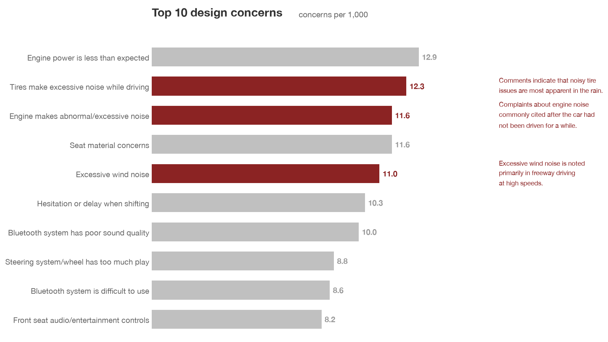
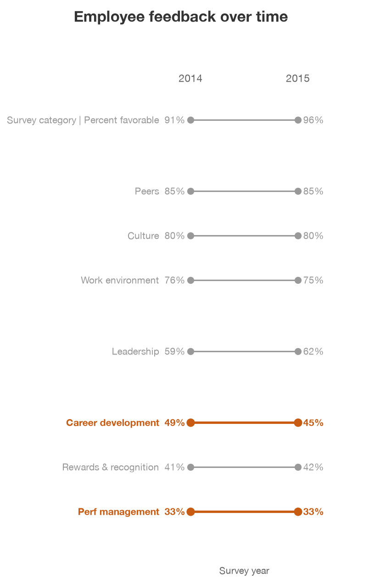

# Chartsmith

A Claude Code skill for generating publication-quality data visualizations following Cole Knaflic's [*Storytelling with Data*](https://www.storytellingwithdata.com/) principles.

<p align="center">
  
</p>

Feed it a CSV or describe your data — Chartsmith infers the right chart type, then produces clean, tweakable Python or R code. Every chart follows a 10-point [design constitution](CONSTITUTION.md): no chart junk, insight-driven titles, direct labels, and a two-layer [color system](PALETTE.md) that puts the story first.

<table>
  <tr>
    <td align="center"><br><sub>Waterfall</sub></td>
    <td align="center"><br><sub>Horizontal Bar</sub></td>
    <td align="center"><br><sub>Slope Chart</sub></td>
  </tr>
</table>

## Install

```bash
# With the skills CLI (recommended)
npx skills add masonsun/chartsmith-skill

# Or clone and run the install script
git clone https://github.com/masonsun/chartsmith-skill.git
cd chartsmith-skill
bash install.sh            # project-level
bash install.sh --global   # all projects
```

## Quick Start

Once installed, Chartsmith activates automatically when you ask Claude Code to create a visualization:

```
> Visualize this CSV as a bar chart highlighting the top 3 categories

> Here's my quarterly revenue data — what chart should I use?

> Create a waterfall chart showing our headcount changes this year
```

### What you get

A complete, runnable script with all configuration at the top:

```python
# --- DATA ---
DATA_FILE = "revenue.csv"

# --- CONTENT ---
TITLE = "Revenue grew 23% after the September campaign"
SUBTITLE = "Monthly revenue, Jan–Dec 2024"

# --- STYLE ---
ACCENT_DARK = "#2B5C8A"
HIGHLIGHT_ITEMS = ["September", "October"]

# --- OUTPUT ---
OUTPUT_FILE = "revenue_growth.png"
```

Change the variables. Run the script. Get a publication-ready chart.

## How It Works

1. **Reads your data** — CSV files, dataframes, or verbal descriptions
2. **Recommends a chart type** — using a decision tree based on data structure
3. **Generates runnable code** — Python (matplotlib) or R (ggplot2)
4. **Follows the constitution** — 10 ranked principles produce clean, honest charts every time

## Supported Chart Types

| Chart | Variants |
|---|---|
| Bar | Horizontal, vertical, stacked, dodged, divergent, 100% stacked |
| Line | Single, grouped, faceted, with range band |
| Slope | Two-period comparison |
| Area | Single, stacked |
| Waterfall | Sequential gains and losses |
| Scatterplot | Standard, 2x2 matrix with quadrant labels |
| Heatmap | Sequential color scale with value labels |
| Sankey | Flow between stages |

## Color System

Every chart uses a two-layer system — gray for context, one accent pair for the story:

| Role | Default | Hex |
|---|---|---|
| Context (light) | Light gray | `#C0C0C0` |
| Context (medium) | Medium gray | `#999999` |
| Accent (primary) | Steel blue dark | `#2B5C8A` |
| Accent (secondary) | Steel blue light | `#8FABBE` |
| Negative/alert | Maroon | `#8B2323` |

Five accent palettes ship by default. See [PALETTE.md](PALETTE.md) for the full reference.

## Examples

The [`examples/python/`](examples/python/) directory contains complete scripts reproducing charts from *Storytelling with Data*:

| Script | Chart | Preview |
|---|---|---|
| `bar_horizontal.py` | Top 10 design concerns | [view](examples/images/bar_horizontal.png) |
| `bar_stacked.py` | Goal attainment (100% stacked) | [view](examples/images/bar_stacked.png) |
| `line_annotated.py` | Ticket volume with annotation | [view](examples/images/line_annotated.png) |
| `waterfall.py` | Headcount math | [view](examples/images/waterfall.png) |
| `slope_chart.py` | Employee feedback over time | [view](examples/images/slope_chart.png) |
| `scatterplot_2x2.py` | Satisfaction vs issues matrix | [view](examples/images/scatterplot_2x2.png) |
| `sample_output.py` | Revenue vs target (end-to-end demo) | [view](examples/images/sample_output.png) |

R (ggplot2) equivalents are in [`examples/r/`](examples/r/):

| Script | Chart | Preview |
|---|---|---|
| `bar_horizontal.R` | Top 10 design concerns | [view](examples/images/bar_horizontal_r.png) |
| `sample_output.R` | Revenue vs target | [view](examples/images/sample_output_r.png) |

## Design Principles

Chartsmith follows a 10-point design constitution adapted from *Storytelling with Data*. Every element earns its place, color is signal not decoration, and titles state the insight. See [CONSTITUTION.md](CONSTITUTION.md) for the full principles.

## Dependencies

```
matplotlib>=3.5
pandas>=1.3
numpy>=1.20
```

Install with `pip install -r requirements.txt`.

## Contributing

See [CONTRIBUTING.md](CONTRIBUTING.md) for guidelines on adding examples and chart types.

## Acknowledgments

Design principles adapted from Cole Knaflic's [*Storytelling with Data*](https://www.storytellingwithdata.com/). Chartsmith is an independent project, not affiliated with or endorsed by the author.

## License

MIT — see [LICENSE](LICENSE).
